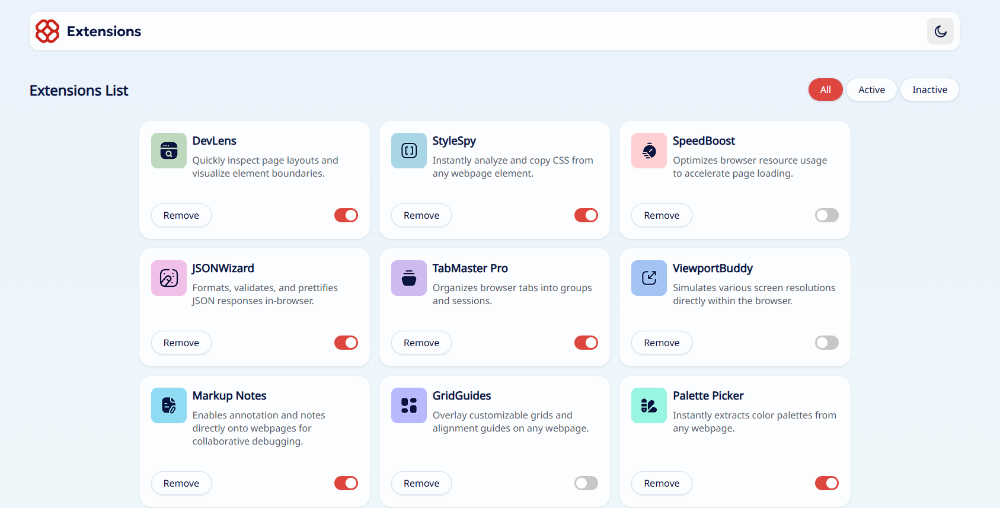
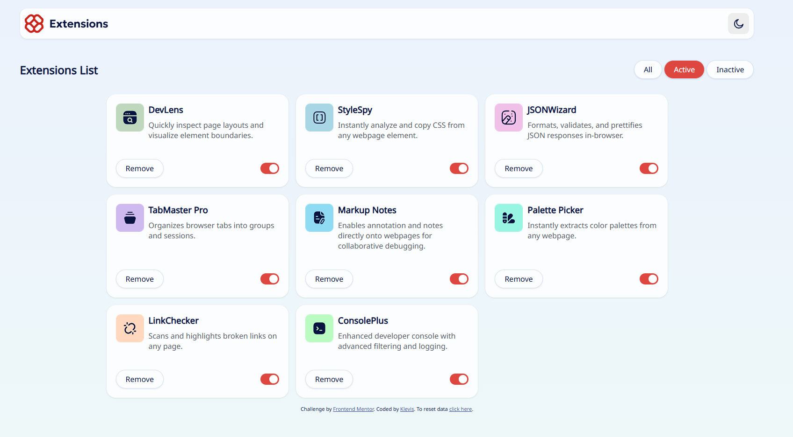
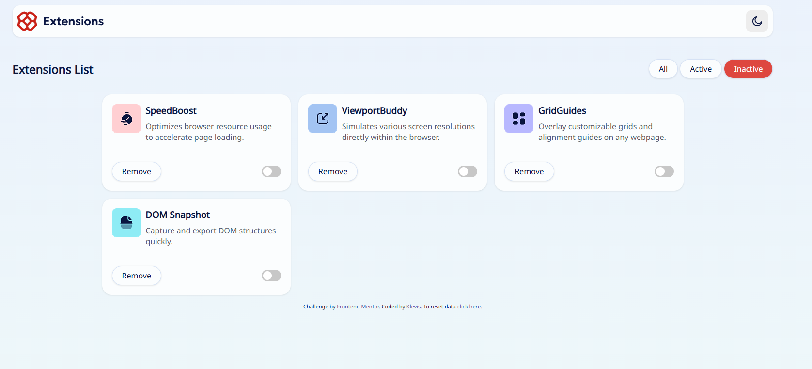
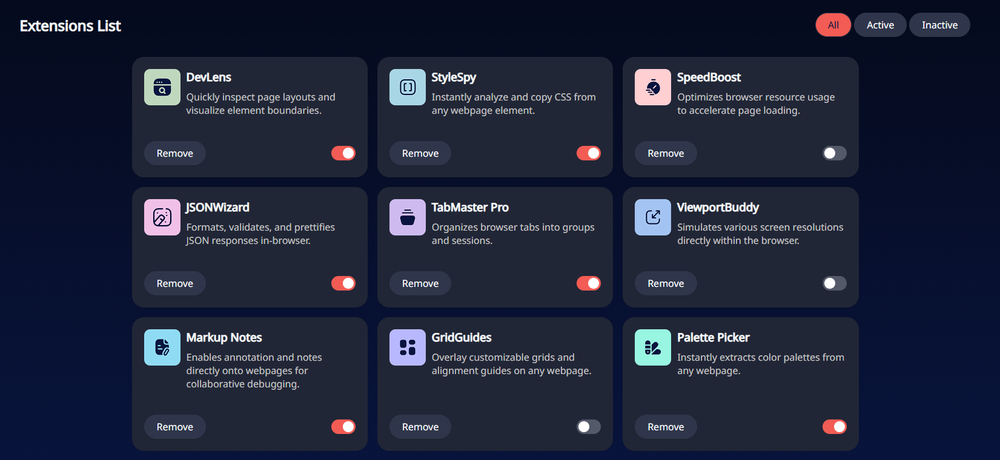

🧩 Browser Extension Landing Page

A responsive Browser Extension Landing Page built as part of a Frontend Mentor challenge.
The project focuses on creating a modern marketing layout with structured sections, call-to-actions, and responsive design.

🚀 Features

- Clean landing page layout
- Feature sections showcasing the extension
- Call-to-action buttons (e.g., download/install)
- Responsive layout (mobile → desktop)
- Modern UI design with structured sections
- Navigation and content organization

| Technology                | Purpose                             |
| ------------------------- | ----------------------------------- |
| **HTML5**                 | Semantic page structure             |
| **CSS3**                  | Styling and layout                  |
| **Flexbox / CSS Grid**    | Layout alignment                    |
| **JavaScript (optional)** | Interactivity (tabs, toggles, etc.) |
| **GitHub Pages**          | Deployment                          |

📸 Sections

The base of the page

The active section

The inactive section

Dark Mode

